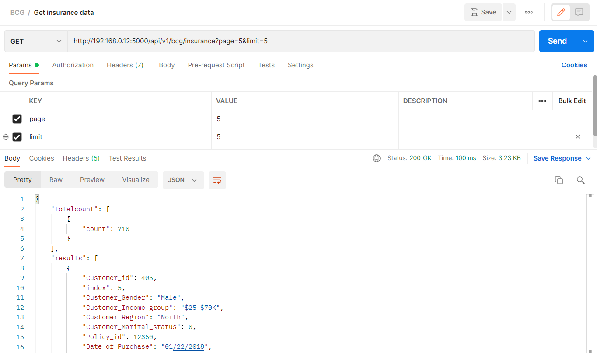

# Insurance Web app Documentation

This application consists of the both frontend with React and backend with Flask. The flask backend consists of REST APIs for getting and updating the data.
The react frontend does API calls to backend to fetch, update and process the data and visualize in the UI screen.

Here are the UI screenshots of the application.

### Database design:
1) This is a normalized design with the foriegn key relationship

### Frontend UI:
1) Home screen with Line chart showing the count of insurance policies across the time

2) Details of the insurance policies with all abilities such as sort, etc

3) Edit page of the insurance policy details with some editable fields.

### Backend API:
1) Get API - To get the insurance data (params - Customer_id/Policy_id)

2) Pup API - To update the insurance and customer data

