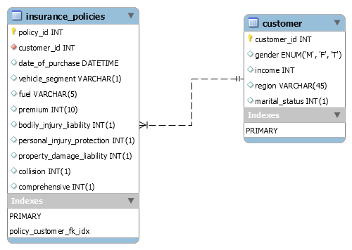
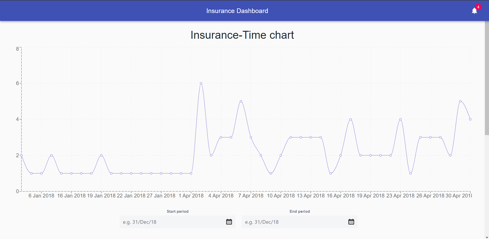
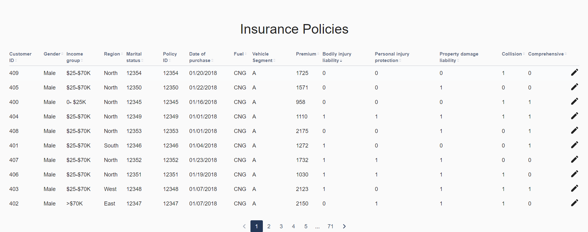
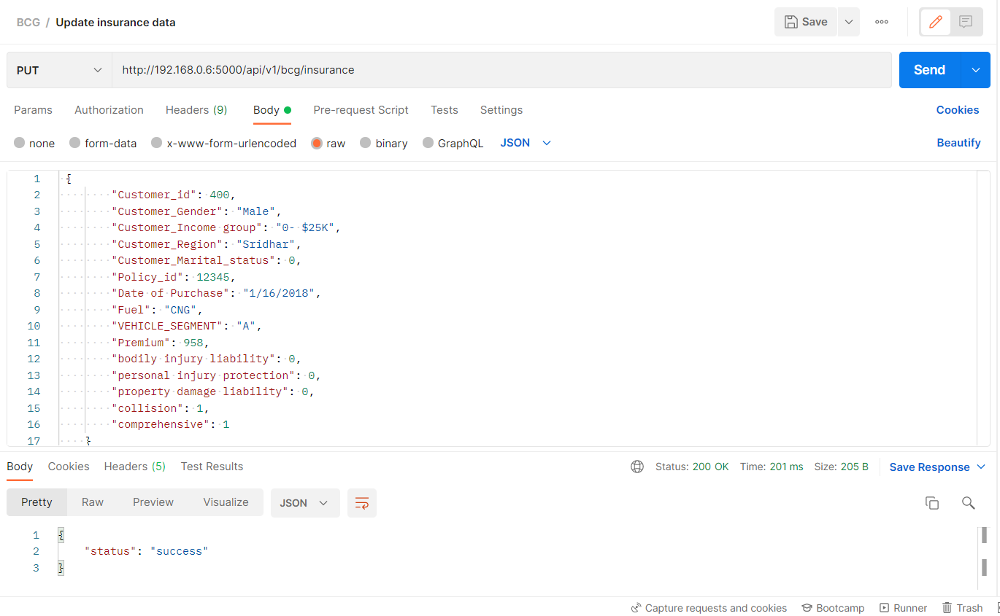

# Insurance Web app Documentation

This application consists of the both frontend with React and backend with Flask. The flask backend consists of REST APIs for getting and updating the data.
The react frontend does API calls to backend to fetch, update and process the data and visualize in the UI screen.

Here are the UI screenshots of the application.

### Database design:
1) This is a normalized design with the foriegn key relationship

### Features
1. The insurance line chart gives you the insights of the customer purchasing the insurance over the period of time. The start and end date can be selected, once both are selected, if end date > start date, then the data is parsed and if it had points between the start and end date, the line-charts is rendered with updated points.
Home screen with Line chart showing the count of insurance policies across the time

2. This shows the records of insurance policies available in the database, which was sourced from the csv file. 
If the data source is a profound csv, we can schedule a script in cron, to take the new csv and source them into the database.
Once the data is available in the database, just by hitting a GET API call with required query params, would give us the result.
Details of the insurance policies

The backend API is equipped with the search abilities with Customer_id and/or Policy_id along with pagination feature.
Get API - To get the insurance data (params - Customer_id/Policy_id)

3. Insurance Data shown in the table, can be updated just by clicking the edit icon on the last column. By doing that it will open a dailog box, with prefilled text boxes with the actual data. 

Other than Customer_id/Policy_id, other fields are editable. If specific values are updated, they are selected and communicated to backend with the help of PUT API.
Put API - To update the insurance and customer data

### Challenges Faced
1. Rendering the parent component from child component.  

### Further changes
1. User features: Search and sort feature in UI and UI and server respectively.
2. API Security: Employing one of the authentication and authorization mechanism, such as Oauth with JWT tokens.
3. Microservice: With the help of docker, we can containerize the server and ui into independently deployable containers.
4. User definition and authentication: We can devise an application with user login/register and allow a superior users for data update. (Can be done easily with Django middlewares)
5. Write codes with proper design principles for clean and robust, reusable code.

### Learning Outcomes
1. Practical implmentations using a React along with connecting the backend for CRUD operations.
2. Working with open source react components such as Atlaskit utilities.
3. UI works